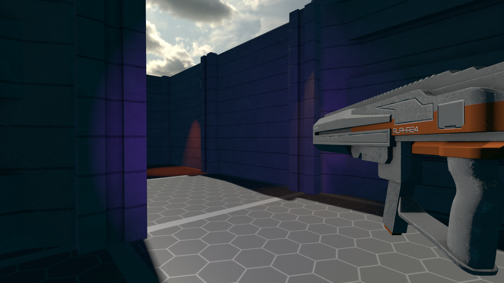
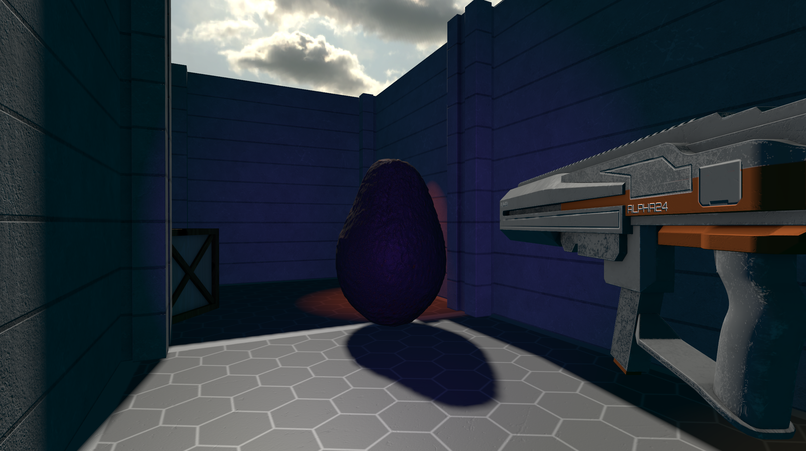
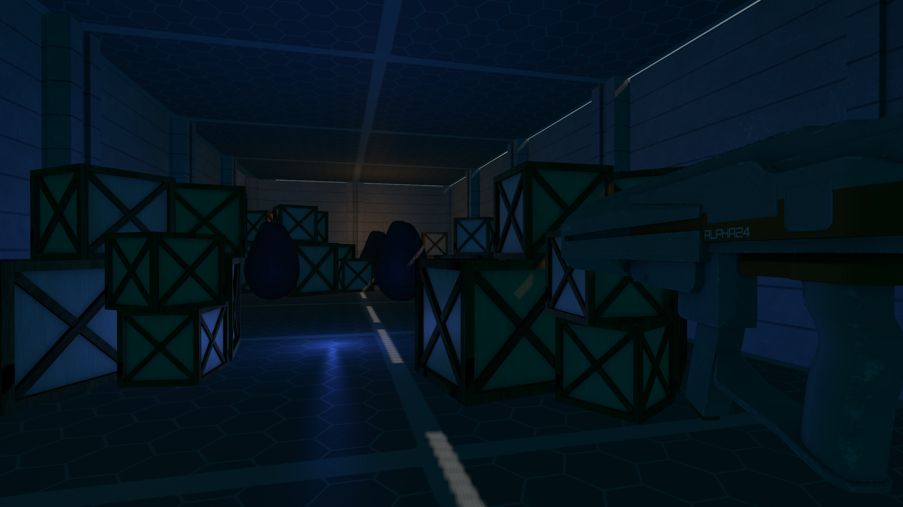
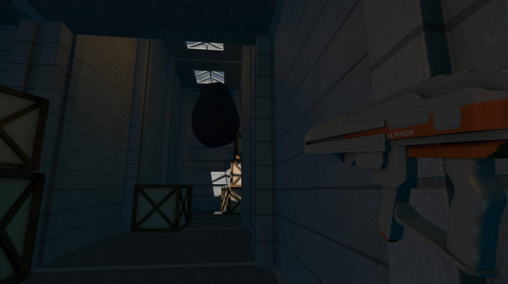
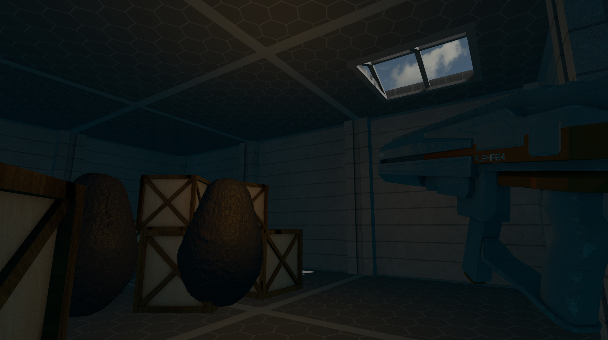
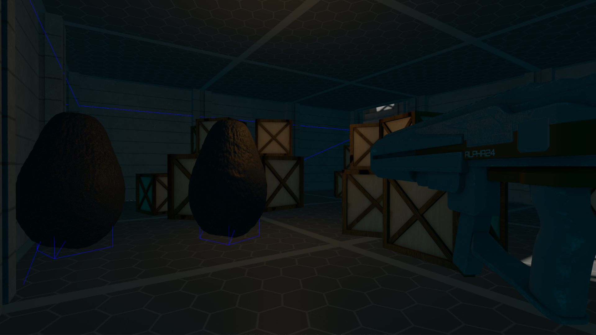

# Avocado - FPS
Simple First Person Shooter game written in C++ and OpenGL.

## Features
- Forward Renderer
  - Directional, point and spot lights
  - Dynamic directional light shadows with PCF filtering
  - Blinn-Phong shading model
  - Skybox
  - Tangent space normal mapping
  - Orthographic & perspective projection
  - Framebuffers, shaders, textures (2D, Cube), material system
- Entity-Component system similar to Unity
- Texture loading
- Model loading
- Raycast based collision
- FPP controller
- Avocados

## Screenshots

## Third Party
 This project uses following third party assets:
 - https://polyhaven.com/ - avocado and barrel
 - [ASSIMP](https://github.com/assimp/assimp)
 - [GLEW](https://glew.sourceforge.net/)
 - [GLFW](https://www.glfw.org/)
 - [glm](https://github.com/g-truc/glm)
 - [stb_image](https://github.com/nothings/stb)
 - [GLSL Shader Includes](https://github.com/tntmeijs/GLSL-Shader-Includes)